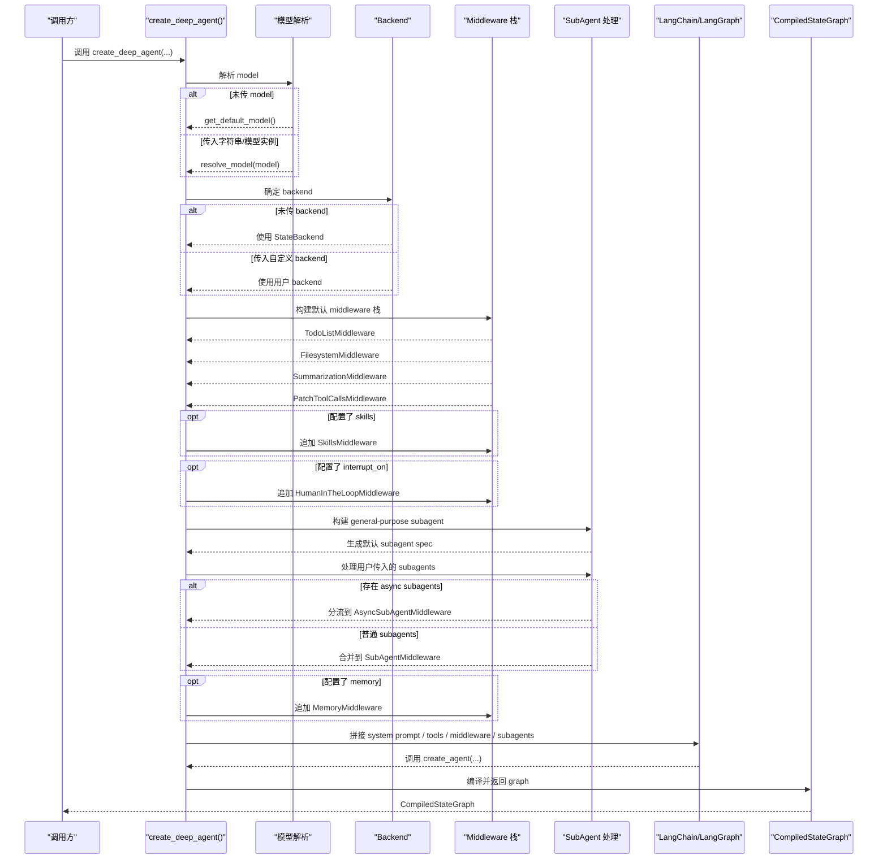

# Day 2 总结

## 今日目标回顾

Day 2 的目标是进入 `deepagents` SDK 的核心装配入口，读懂 `create_deep_agent()` 到底在做什么。

今天的核心不是继续停留在 README 层，而是明确：

1. `create_deep_agent()` 是 SDK 的核心入口
2. 它不是在创建一个简单的模型对象
3. 它是在装配一个完整的 agent runtime

---

## Day 2 的核心结论

今天最关键的一句话是：

`deepagents` 的重点不是 model wrapper，而是 agent runtime 装配。

这句话的意思是：

- 它不是简单地封装 OpenAI / Anthropic 模型调用
- 它真正做的是把 model、tools、prompt、middleware、backend、subagents、memory 等能力组合起来
- 最终返回的不是“模型实例”，而是一个可运行的 `CompiledStateGraph`

所以，`create_deep_agent()` 更像一个应用装配器，而不是一个普通工具函数。

---

## 从 `__init__.py` 学到的东西

文件：

- `libs/deepagents/deepagents/__init__.py`

这个文件虽然很短，但很重要，因为它定义了 SDK 的公开门面。

从这个文件可以看出，`deepagents` 对外暴露的核心内容是：

- `create_deep_agent`
- `FilesystemMiddleware`
- `MemoryMiddleware`
- `SubAgentMiddleware`
- `SubAgent`
- `CompiledSubAgent`
- `AsyncSubAgent`

这说明：

- SDK 的核心入口是 `create_deep_agent`
- 框架的核心扩展方式是 middleware
- 子 agent 能力是架构中的一等概念

前端类比：

这个文件相当于库的 `index.ts`，它不是实现层，而是公开 API 门面。

---

## 从 `graph.py` 开头学到的东西

文件：

- `libs/deepagents/deepagents/graph.py`

### 1. `BASE_AGENT_PROMPT`

这个 prompt 不是普通提示词，而是 agent 的默认行为协议。

它定义了这个 agent 的工作方式，比如：

- 先理解，再行动，再验证
- 长任务中需要提供简短进度更新
- 不要做一半停下来解释
- 避免无意义前言

这说明：

- `deepagents` 把 prompt 当成系统组成部分
- prompt 在这里不是“文案”，而是 runtime 的行为规则

### 2. `get_default_model()`

这个函数定义了默认模型。

这说明两件事：

- 这个框架默认可运行
- 但模型只是默认依赖，不是系统中心

因为 `create_deep_agent()` 支持：

- 不传 model
- 传字符串 model
- 传 `BaseChatModel`

所以模型在这里是可替换依赖，而不是框架本体。

---

## `create_deep_agent()` 的核心主线

今天最重要的主线就是这条装配顺序：

1. 先确定模型
2. 再确定 backend
3. 再确定 middleware 栈
4. 再准备默认 subagent
5. 后面继续处理其他配置
6. 最终编译 graph

这个顺序说明：

`create_deep_agent()` 不是在“创建一个模型调用器”，而是在“创建一个完整的 agent 运行系统”。

---

## Day 2 时序图

下面这张图是今天最核心的输出。

### 如何理解这张图

这张图说明了：

- `create_deep_agent()` 不是单步动作，而是一系列装配过程
- 它先搭“运行能力”，再生成最终 graph
- 最终产物是一个可执行的 LangGraph graph，而不是一个模型对象

---

## 前端视角下的理解

你可以把 `create_deep_agent()` 理解成：

- 不是 `axios.create()`
- 也不是一个 `fetch` 封装
- 更像 `createApp()` + router + store + plugins + middleware 的总装配器

也就是说：

- model 像应用中的核心引擎之一
- backend 像运行环境
- middleware 像插件和横切能力
- subagents 像内建 worker / 子任务执行器
- graph 像最终编译后的可运行实例

一句话理解：

`deepagents` 不是在造“模型对象”，而是在造“agent 应用”。`

---

## 今日关键词

- `create_deep_agent`
- `BASE_AGENT_PROMPT`
- `get_default_model`
- `StateBackend`
- `Middleware`
- `SubAgent`
- `CompiledStateGraph`
- `runtime 装配`

---

## 今天的收获

- 我知道了 `deepagents` 的 SDK 公开入口是什么
- 我知道了 `graph.py` 是最重要的源码入口
- 我知道了 Day 2 的关键不是参数记忆，而是装配思维
- 我知道了这个框架的核心是 agent runtime，而不是 model wrapper

---

## 明天预告

Day 3 会继续进入 middleware 设计，重点看：

- `filesystem.py`
- `subagents.py`
- `summarization.py`
- `patch_tool_calls.py`

目标是彻底看懂：

- 默认能力是怎么一层层挂进去的
- 为什么 middleware 是这个框架的核心组织方式
- 为什么这套设计让 agent 能处理更复杂的任务
